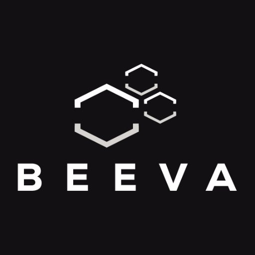
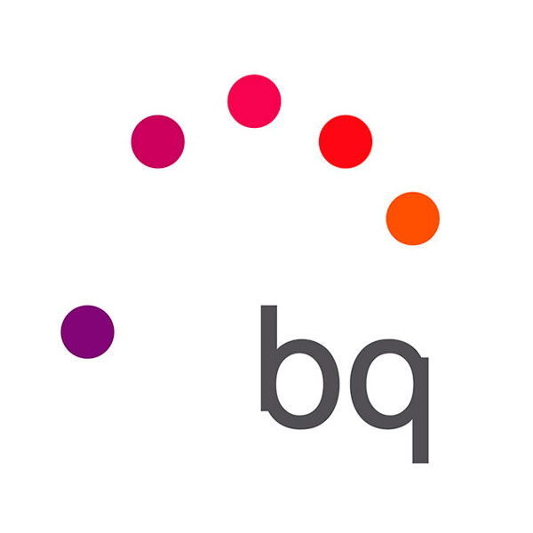

 

   **Backend/Big Data Developer** **at BEEVA**  
_From Aug 2016 to now - 1 year and 5 months_   

I am currently working in BEEVA (BBVA Group) where I perform software design and development tasks. We use Java, Python, Scala and NodeJS and especially Amazon Web Services stack and other technologies related to operating with cloud computing and big data.

 

***

   **Backend Developer** **at A3data**  
_From May 2016 to Aug 2016 - 4 months_   

I carried out development works related to web backend.

 

***

   **Backend Developer** **at bq**  
_From Nov 2015 to Apr 2016 - 6 months_   

I was part of a multidisciplinary team (we all do everything) which developed and tested many sort of backend modules of Corbel-Platform using several technologies and techniques. Corbel-Platform is an Open Source "BaaS" (Backend as a Service) having a microservices structure which provides all you need to build any application such as authentication, resources or events,.. and it can be used in many software fields to build a backend and customize it for any project.

 

***

   **QA Software Automation Tester** **at bq**  
_From Dec to Nov 2015 - 1 year_     

In this job, I have carried out tasks in "Digital Entertainment Department” connected with measuring the quality of apps and webs and detecting bugs, using testing automation techniques and technologies. I have especially worked with android and ios teams.

In addition, I have designed and developed a proprietary automation framework intended to make tests more easily and run them more quickly. The framework core uses Appium and Selenium. Furthermore, it contains many others helpful integrated frameworks that let us run parallelize tests, sign binaries and so on, it also contains some appium custom modules.

 

***
 
   **Research Staff Member** **at SMILE - Soft Management of Internet and Learning (UCLM Research Group)**  _From Jul 2013 to Jan 2015 - 1 year and 7 months_    

SMILe is a research group belonging to the University of Castilla - La Mancha. The main lines of research are related with Soft-Computing and Learning: Information Recovery, Machine Learning, development of Search Engines, development of Decision Support Systems and Knowledge Management. In it, I have carried out tasks related to research in the Artificial Intelligence field: making papers to publish our research, participating in events and joining in external clients projects to provide them more sophisticated systems in the artificial intelligence field.

 

***

   **Android Developer** **at Vsoftworks**   _From May 2012 to Aug 2012 - 4 months_     

I designed and developed an Android app for a shopping center called Aqualon (http://www.ccaqualon.com/). The app was accepted and published in Play Store (2012). 
Now, it’s not longer available but it can be found in third web stores such as: http://bit.ly/1qe4Ydu. 

 

***

  **Web Developer** **at Sax Ensemble**    _From Jan 2010 to Mar 2010 - 3 months_    

Working as a programmer reforming the official website 

 

***
